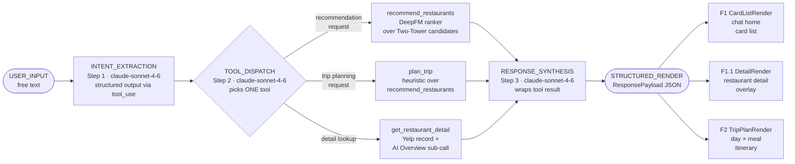

### §3.2 LLM Workflow

> [!info] v2 更新说明 · 2026-05-04
>
> **Sib B2 产出**。本版本（v2）将 §3.2 的组织维度从"抽象 pipeline 步骤"翻转为"产品功能场景"，以 Figma Make 原型审计（`figma_make_audit.md` §6）为 ground truth，新增 10 个场景子节（S1–S10），每个场景覆盖完整 elfen 四件套：输入数据表 / 模型工作流 / 完整 prompt（含 few-shot 示例）/ TypeScript I/O 接口。
>
> **保留自 v1**：§3.2.0 链路概览（mermaid）+ §3.2.1 LLM 选型决策 + §3.2.5 Token/成本估算（已更新）。
>
> **替换自 v1**：§3.2.2（3-step pipeline 规格）→ 按场景结构化规格；§3.2.3（tool 列表）→ 更新含新增 2 个 tool；§3.2.4（错误处理）→ 补充 3 行 trip 专属错误。

---

#### §3.2.0 链路概览

Taste hunter 的 LLM 层充当用户与 DeepFM 推荐引擎之间的语义桥梁：每一条用户自然语言输入都要经过三个串行 LLM 调用（意图抽取 → 工具派发 → 响应合成），偶有第四次子调用（`get_restaurant_detail` 的 AI Overview 生成，或 `plan_trip` 内部的行程解析 + 活动序列生成子调用）。整条链路单轮单工具——LLM 在 Tool Dispatch 步骤只选择一个工具调用；如果用户意图需要多轮细化（如先推荐再看详情），由重新输入触发下一轮，不做链式自动循环，降低调试复杂度并保证 class demo 时的可预期性。最终输出是一个 `ResponsePayload` JSON，前端将其渲染为 F1 卡片列表、F1.1 详情页或 F2 行程规划视图。



> [!info] ✅ 决策 — 单工具单轮
>
> Tool-calling 是 **single-turn**：每次用户消息 LLM 只选 **一个** tool 调用。链式调用（如先 recommend 再 get_detail）通过用户的下一条消息触发，不做自动 chain。原因：（1）减少 demo 出错的表面积；（2）Anthropic tool_use API 在 force 模式下 single-tool 更可靠；（3）对 class 评审者来说链路更透明，更容易解释 pipeline。

> [!info] 10 个产品场景索引
>
> 下表将 S1–S10 映射到三步抽象 pipeline 层，快速定位每个场景的 LLM 调用位置：
>
> | 场景 | 名称 | Intent Extraction | Tool Dispatch | Response Synthesis | 子 LLM 调用 |
> |---|---|---|---|---|---|
> | **S1** | F1 进入屏初始推荐 feed | ❌ 系统触发 | `recommend_restaurants` | Greeting Synthesis | Reason Chip × 10 |
> | **S2** | F1 自然语言对话精化 | ✅ Step 1 | `recommend_restaurants` | ✅ Step 3 | — |
> | **S3** | F1 message-action 反馈 | ❌ action_type 直接路由 | 软重排（非 LLM） | 简短 ack | — |
> | **S4** | F1 → F1.1 详情展开 + AI Overview | ❌ click 触发 | `get_restaurant_detail` | ✅ Step 3 | AI Overview sub-call |
> | **S5** | F1.1 底部导航兄弟切换 | ❌ 纯前端 | cache miss → `get_restaurant_detail` | — | AI Overview（cache miss 时） |
> | **S6** | F1 → F2 Trip Plan 生成 | ✅ Step 1 | `plan_trip` | ✅ Step 3 | 行程解析 + 活动序列生成 × 9 |
> | **S7** | F2 Day Tab 切换 | ❌ 纯前端 | — | — | — |
> | **S8** | F2 候选切换（每段 ‹ ›） | ❌ 纯前端 | — | — | — |
> | **S9** | F2 行程导出 | ❌ 格式化触发 | — | 可选 narrative wrap | — |
> | **S10** | F2 内对话精化 | ✅ Step 1 | `modify_trip_slot` | ✅ Step 3 | — |

---

#### §3.2.1 LLM 选型决策

> [!success] ✅ 决策 — 采用 Claude Sonnet 4.6（`claude-sonnet-4-6`）
>
> 综合 tool-calling 可靠性、延迟、成本、以及 class demo 时间线，选定 **Claude Sonnet 4.6** 为主模型。理由：Sonnet 在 Anthropic 原生 tool_use 强制模式下 JSON 结构输出成功率最高；比 Haiku 在多字段意图抽取和 tool dispatch 准确性上显著更稳；Opus 对此场景过于重量级（延迟 + 成本均不划算）。OSS 本地模型（Llama 系列）在 tool calling 格式规范性上未达到 class demo 要求的成功率门槛，且推理速度无法在演示中做到实时响应。
>
> **Fallback**：如果单 session 成本或 p95 延迟超过阈值，降级至 Haiku 4.5（仅用于 intent extraction 步骤，dispatch + synthesis 保持 Sonnet）。

| 模型                    | Context Window | Tool-calling 质量                              | p50 延迟（est.） | 成本（input+output / 1M tok） | 是否选用           |
| --------------------- | -------------- | -------------------------------------------- | ------------ | ------------------------- | -------------- |
| **Claude Sonnet 4.6** | 200K           | ★★★★★ Anthropic 原生 tool_use，强制 JSON 成功率 ~99% | ~1.2s        | $3 + $15 = $18            | ✅ **主模型**      |
| Claude Haiku 4.5      | 200K           | ★★★★☆ 快但多字段 intent 偶尔遗漏 dietary/mood         | ~0.4s        | $0.80 + $4 = $4.80        | ⚠️ 降级 fallback |
| GPT-4o                | 128K           | ★★★★★ 优秀，但非 Anthropic SDK，需额外集成层             | ~1.5s        | $2.50 + $10 = $12.50      | ❌ 不选（SDK 切换成本） |
| GPT-4o-mini           | 128K           | ★★★☆☆ tool dispatch 偶有格式错误，需 retry 逻辑        | ~0.6s        | $0.15 + $0.60 = $0.75     | ❌ 不选（质量风险）     |
| Llama 3.3 70B local   | 128K           | ★★☆☆☆ tool_use JSON 格式不稳定，需自定义解析             | ~3-8s        | $0（本地算力）                  | ❌ 不选（速度 + 稳定性） |

---

#### §3.2.2 按产品功能场景的 LLM / Recommender 调用规范

---

##### §3.2.2.S1 — F1 进入屏初始推荐 feed

**触发**：用户打开 app（或从 F1.1 / F2 返回 F1 主屏）。无用户文本输入，由系统以 `user_ctx` 驱动。

**输入数据**：

| 字段 | 类型 | 来源 | 说明 |
|---|---|---|---|
| `user_ctx.lat` / `lon` | `number` | 设备 GPS（demo 用 Redmond WA 硬编码） | 地理位置，用于 geo 召回 |
| `user_ctx.local_time` | `string` (ISO 8601) | 客户端系统时间 | 决定 `hour_bucket`（早/中/晚） |
| `user_ctx.city` / `state` | `string` | 反向地理编码 | 用于 Greeting Synthesis 文案 |
| `user_ctx.accumulated_prefs` | `AccumulatedPrefs` | session 历史对话累积 | 初次打开为空对象，再访用户携带历史偏好 |

**模型工作流**：

1. **Greeting Synthesis 子调用**（Sonnet 4.6）—— 输入 `hour_bucket` + `city` + `day_of_week`，生成 F1 顶部 H1 文案（如 "Wed brunch in Redmond ☕"）与副标题（如 "10:32 AM · 5 picks based on your location & this week's trends"）。无 tool_use，直接文本生成。

2. **Recommender 调用** `recommend_restaurants`（DeepFM）—— `intent` 为空对象 `{}`，兜底用 popularity × geo × `hour_bucket` × city embedding × `user_emb` 排序，返回 top-10 候选。

3. **Reason Chip Synthesis 子调用**（Sonnet 4.6）—— 对 top-10 中的每一个候选，根据其在 DeepFM ranking 中胜出的最强特征（距离 / 热度 / cuisine match / 用户历史相似度）生成 ≤30 字 reason chip 文案（如 "📍 0.3 mi · 今日爆满"）。实现上可以批量：一次调用生成 10 条 chip，减少 API roundtrip。

**Greeting Synthesis — 完整 Prompt**

```text
<role>
You are Tastebud, the friendly voice of Taste hunter restaurant chatbot.
Your task is to write a warm, context-aware greeting for the top of the home feed.
Output ONLY a JSON object with exactly two fields: "h1" and "subtitle". No prose, no markdown.
</role>

<task>
Generate the greeting header for the user's home feed based on their location and current time.
- h1: a short, evocative title (≤ 40 characters). Include a relevant emoji. Examples: "Wed brunch in Redmond ☕", "Sunday dinner vibes 🌆", "Quick lunch, Bellevue 🥡".
- subtitle: a factual one-liner (≤ 80 characters) mentioning the time and how many picks. Examples: "10:32 AM · 5 picks based on your location & this week's trends", "6:45 PM · 10 top picks near you".
Do NOT mention the user's name. Do NOT make claims you can't support (e.g., "best in the city" is fine as a colloquial expression; exact claim statistics are not).
</task>

<constraints>
- h1 must be ≤ 40 characters including the emoji.
- subtitle must be ≤ 80 characters.
- Language: English only (regardless of user locale — this UI string is always EN).
- Output strictly: {"h1": "...", "subtitle": "..."} — no other keys.
</constraints>

<few_shot_examples>
Example 1:
Input: { "hour_bucket": "brunch", "city": "Redmond", "state": "WA", "day_of_week": "Wednesday", "top_k": 5 }
Output: {"h1": "Wed brunch in Redmond ☕", "subtitle": "10:32 AM · 5 picks based on your location & this week's trends"}

Example 2:
Input: { "hour_bucket": "dinner", "city": "Los Angeles", "state": "CA", "day_of_week": "Friday", "top_k": 10 }
Output: {"h1": "Friday night in LA 🌆", "subtitle": "7:15 PM · 10 top picks near you for dinner"}

Example 3:
Input: { "hour_bucket": "lunch", "city": "Chicago", "state": "IL", "day_of_week": "Monday", "top_k": 10 }
Output: {"h1": "Monday lunch, Chicago 🥡", "subtitle": "12:05 PM · 10 nearby spots ready for lunch"}
</few_shot_examples>

<context>
hour_bucket: {{hour_bucket}}
city: {{user_ctx.city}}
state: {{user_ctx.state}}
day_of_week: {{day_of_week}}
top_k: {{top_k}}
</context>
```

**Reason Chip Synthesis — 完整 Prompt（批量生成 10 条）**

```text
<role>
You are Tastebud's card annotator. For each restaurant in the ranked list below,
write a short reason chip explaining WHY this restaurant appears in the user's feed.
Output ONLY a JSON array of strings — one chip per restaurant, in the same order as input.
</role>

<task>
For each restaurant, pick the single strongest signal from its ranking metadata:
1. If distance < 0.5 mi → lead with distance: "📍 0.3 mi · 今日爆满"
2. If user history similarity is the top feature → lead with personal match: "基于你的口味偏好"
3. If cuisine matches current hour_bucket strongly → "早午餐热门 · 本地推荐"
4. If popularity_score is the top signal → "本周最热 · 571 条好评"
Chip must be ≤ 30 characters total. Chinese preferred; emoji allowed but not required.
</task>

<constraints>
- Output: a JSON array of exactly N strings where N = number of restaurants provided.
- Each string ≤ 30 characters (measured in code units, not bytes).
- Do NOT reveal raw scores, model internals, or business_id.
- Do NOT write identical chips for different restaurants.
</constraints>

<few_shot_examples>
Input restaurants (abbreviated):
[
  {"name": "Moonlark's Dinette", "distance_mi": 0.3, "top_feature": "geo_proximity", "review_count": 312},
  {"name": "Cafe Corina", "distance_mi": 1.2, "top_feature": "user_history_similarity", "review_count": 189},
  {"name": "Marlowe's Kitchen", "distance_mi": 0.8, "top_feature": "cuisine_hour_match", "review_count": 427}
]
Output:
["📍 0.3 mi · 附近首选", "基于你的口味偏好", "早午餐热门 · 本地推荐"]
</few_shot_examples>

<ranked_restaurants>
{{ranked_candidates | json}}
</ranked_restaurants>

<context>
hour_bucket: {{hour_bucket}}
user_accumulated_prefs: {{user_ctx.accumulated_prefs | json}}
</context>
```

**TypeScript Interfaces — S1**

```typescript
interface GreetingSynthesisInput {
  hour_bucket: "breakfast" | "brunch" | "lunch" | "dinner" | "late_night";
  city: string;
  state: string;
  day_of_week: string;   // "Monday" … "Sunday"
  top_k: number;
}

interface GreetingSynthesisOutput {
  h1: string;            // ≤ 40 chars, shown as H1 in F1 top bar
  subtitle: string;      // ≤ 80 chars, shown below H1
}

interface ReasonChipBatchInput {
  ranked_candidates: Array<{
    business_id: string;
    name: string;
    distance_mi: number;
    top_feature: "geo_proximity" | "user_history_similarity" | "cuisine_hour_match" | "popularity";
    review_count: number;
  }>;
  hour_bucket: string;
  user_ctx: UserContext;
}

type ReasonChipBatchOutput = string[];  // length == ranked_candidates.length, each ≤ 30 chars

// S1 final output delivered to frontend
interface S1Output {
  greeting: GreetingSynthesisOutput;
  render: CardListRender;              // cards[0..9] with reason_chip populated
}
```

**输出**：`CardListRender`（cards: 10，每张含 `reason_chip`）→ F1 ChatHome 渲染前 3 张，chevron 展开显示 4–10。

---

##### §3.2.2.S2 — F1 自然语言对话精化

**触发**：用户在 F1 input bar 输入自然语言（如"想吃辣，人均 30 以下"）并点 send 按钮。

**输入数据**：

| 字段 | 类型 | 来源 | 说明 |
|---|---|---|---|
| `user_text` | `string` | 用户输入 | 本轮消息原文 |
| `conversation_history` | `Turn[]` | session state | 最近 3 轮，含 role + content |
| `user_ctx` | `UserContext` | 设备 + session 累积 | 位置、时间、偏好历史 |

**模型工作流**：

1. **Step 1 — Intent Extraction**（Sonnet 4.6）—— 解析 `user_text` + `conversation_history` → `IntentExtractionResult`（包含 cuisine / budget / dietary / mood / distance / `is_trip_planning_request=false`）。

2. **Step 2 — Tool Dispatch**（Sonnet 4.6）—— 基于 `IntentExtractionResult` 选择 `recommend_restaurants`（S2 场景下 `is_trip_planning_request` 始终为 false，无具体商家名称）。

3. **Recommender 调用** `recommend_restaurants`（DeepFM）—— 携带完整 `IntentExtractionResult` 作为 context features，返回 top-10 按 intent 重排后的候选。

4. **Step 3 — Response Synthesis**（Sonnet 4.6）—— 将 tool result wrap 成 `reply_text`（1–3 句中文）+ 新一轮 `CardListRender`（替换上一轮卡片）。

> [!info] S2 复用 v1 §3.2.2 Step 1–3 的完整 prompt 规格
>
> S2 是 Taste hunter 最核心的对话场景，三步 pipeline 的完整 prompt 已在 v1 §3.2.2 中定义。本节简要列出 I/O 接口。完整 prompt 全文（Intent Extraction / Tool Dispatch / Response Synthesis）见 v1 §3.2.2 Step 1–3。

**TypeScript Interfaces — S2**

```typescript
// 复用 v1 定义
// UserContext, Turn, IntentExtractionResult, RecommendInput, RecommendOutput, ResponsePayload
// 见 v1 §3.2.2 Step 1 / Step 3 TS interface

interface S2Input {
  user_text: string;
  conversation_history: Turn[];
  user_ctx: UserContext;
}

interface S2Output extends ResponsePayload {
  render: CardListRender;   // replaces previous card list; top 3 shown immediately
}
```

**输出**：新一轮 `CardListRender`（替换上一轮卡片）+ `reply_text`（渲染在卡片列表上方）→ F1 ChatHome 刷新。

---

##### §3.2.2.S3 — F1 Message-Action 反馈循环

**触发**：用户点击当前消息下方的 `thumbs_up` / `thumbs_down` / `refresh` 任一 lucide icon。

**输入数据**：

| 字段 | 类型 | 来源 | 说明 |
|---|---|---|---|
| `message_id` | `string` | F1 当前消息 | 标识哪条 AI 消息被操作 |
| `business_ids` | `string[]` | 当前展示的 top-10 列表 | 用于 exclude 或 feedback 记录 |
| `dominant_cuisine` | `string` | 当前列表分析 | thumbs-down 时，排除这个主 cuisine |
| `action_type` | `"thumbs_up" \| "thumbs_down" \| "refresh"` | 用户点击 | 路由到不同处理逻辑 |
| `user_ctx` | `UserContext` | session | 地理 + 偏好 |

> [!info] 纯前端 / 无主 LLM 调用（thumbs_up / refresh）
>
> - **thumbs_up**：仅记录正向 feedback 到 `user_feedback` 表（隐式 like 信号），**不重新生成卡片**，不调用 LLM。UI 展示短暂 toast "已收藏~"。
> - **refresh**：直接调用 `recommend_restaurants(exclude_ids=[当前 10 个])`，返回 next-10 候选。无 LLM 子调用，只有 DeepFM 推荐器。
> - **thumbs_down**：触发软重排 —— 调用 `recommend_restaurants(exclude_categories=[dominant_cuisine], exclude_ids=[当前 10 个])`，返回不含当前主 cuisine 的新列表。同样无 LLM 子调用。

**模型工作流**：

1. 根据 `action_type` 路由：
   - `thumbs_up` → 写 feedback log → UI ack，停止。
   - `thumbs_down` → 识别 `dominant_cuisine`（当前 top-3 中出现次数最多的 cuisine） → 调用 `recommend_restaurants(exclude_categories, exclude_ids)` → 返回新 `CardListRender`。
   - `refresh` → 调用 `recommend_restaurants(exclude_ids)` → 返回新 `CardListRender`。

**TypeScript Interfaces — S3**

```typescript
type FeedbackActionType = "thumbs_up" | "thumbs_down" | "refresh";

interface S3Input {
  message_id: string;
  business_ids: string[];       // current top-10 business IDs on screen
  dominant_cuisine: string;     // pre-computed from current card list
  action_type: FeedbackActionType;
  user_ctx: UserContext;
}

interface S3Output {
  action_taken: FeedbackActionType;
  feedback_logged: boolean;      // always true for thumbs_up
  new_render?: CardListRender;   // present for thumbs_down and refresh; absent for thumbs_up
  ack_text: string;              // e.g. "已记录 👍" | "换一批了！" | "好，换个口味~"
}
```

**输出**：thumbs_up → feedback ack；thumbs_down / refresh → 新 `CardListRender` 替换当前。

---

##### §3.2.2.S4 — F1 → F1.1 详情卡片展开 + AI Overview 生成

**触发**：用户在 F1 卡片列表中点击任意一张卡片，触发 F1.1 bottom sheet modal（rounded-top 20pt + 40% backdrop）slide-up。

**输入数据**：

| 字段 | 类型 | 来源 | 说明 |
|---|---|---|---|
| `business_id` | `string` | 被点击的卡片 | Yelp business_id |
| `include_ai_overview` | `boolean` | 系统默认 `true` | 是否触发 AI Overview 子 LLM 调用 |
| `max_reviews_for_summary` | `number` | 系统默认 `10` | 送给 AI Overview sub-LLM 的最大 review 数 |

**模型工作流**：

1. **Tool 调用** `get_restaurant_detail(business_id, include_ai_overview=true, max_reviews_for_summary=10)` —— 后端从 Yelp 数据集拉取商家完整记录（name / rating / review_count / category / address / hours / photos / top_reviews / menu_items）。

2. **AI Overview 子 LLM 调用**（Sonnet 4.6）—— 仅在 `include_ai_overview=true` 时触发，由 tool `summarize_reviews_for_overview` 内部触发。输入：top-10 review 文本 + categories + attributes（`good_for_meal` / `ambience` / `noise_level`）+ 推断的 `best_dishes`；输出：2–3 句话 editorial summary。

3. **Step 3 — Response Synthesis**（Sonnet 4.6）—— 将 `RestaurantDetail` wrap 成 `DetailRender`，含 `ai_overview` + `top_review` + `menu_preview`。

**AI Overview Sub-call — 完整 Prompt**

```text
<role>
You are an editorial food writer specializing in concise, vivid restaurant summaries.
You will receive Yelp reviews and restaurant metadata for ONE restaurant.
Your job: produce a 2-3 sentence AI Overview that captures the restaurant's character,
standout dishes, and vibe. The tone is warm and authoritative — like a trusted local friend's recommendation.
Output ONLY a JSON object with field "ai_overview": "...". No other keys, no markdown.
</role>

<task>
Read the reviews and metadata below. Extract:
1. The most-mentioned standout dish or item (with price if available).
2. The ambience / vibe (e.g., "chill local hangout", "upscale date spot", "fast casual").
3. One memorable detail that differentiates this place (unique prep method, seasonal special, etc.).
Synthesize these into 2-3 sentences. Write in English. ≤ 120 words total.
Do NOT copy-paste review text verbatim — paraphrase and synthesize.
Do NOT use superlatives like "best in the city" unless there is strong review consensus.
</task>

<constraints>
- Output: {"ai_overview": "..."} only.
- ≤ 120 words.
- No first-person ("I think..."). Write in third person editorial voice.
- Mention at least one specific dish name.
- If noise_level is "very_loud" and good_for_romantic is false, note "lively atmosphere" rather than "great for a quiet date".
</constraints>

<few_shot_examples>
Example 1:
Restaurant: Tatsu Ramen (Arts District, LA) · Ramen · $$
Top attributes: good_for_lunch=true, ambience=casual, noise_level=average
Top reviews excerpt:
  - "The tonkotsu broth is rich and silky — clearly simmered for hours. Best ramen in LA."
  - "Spicy miso is a weekly go-to. Staff is super friendly."
  - "More locals than tourists. Relaxed vibe, no pretension."
Best dish inference: Tonkotsu Ramen ($16), Spicy Miso ($17)
Output:
{"ai_overview": "Tatsu Ramen's tonkotsu broth — simmered a full 12 hours — delivers the kind of depth that makes regulars come back weekly. The spicy miso is an equally strong contender, with a well-balanced heat that doesn't overwhelm the noodles. A genuinely local crowd and an unhurried atmosphere make this Arts District spot one of the most honest ramen experiences in the city."}

Example 2:
Restaurant: Cafe Corina (Pasadena, CA) · Cafe · $
Top attributes: good_for_brunch=true, ambience=romantic, noise_level=quiet
Top reviews excerpt:
  - "Perfect brunch spot — eggs benedict are outstanding."
  - "Tiny and charming. Book ahead on weekends."
  - "Wonderful patio, very romantic for a quiet morning."
Best dish inference: Eggs Benedict ($14)
Output:
{"ai_overview": "Cafe Corina earns its loyal following with an eggs benedict that sets the benchmark for Pasadena brunch. The space is intimate — seats fill fast on weekends, so reservations are wise. A shaded garden patio adds a romantic touch that makes lingering over coffee feel entirely justified."}
</few_shot_examples>

<restaurant_metadata>
name: {{restaurant.name}}
category: {{restaurant.category | join(", ")}}
price_range: {{restaurant.price_range}}
attributes: {{restaurant.attributes | json}}
best_dishes_inferred: {{restaurant.menu_preview}}
</restaurant_metadata>

<top_reviews>
{{restaurant.top_reviews | format_reviews}}
</top_reviews>
```

**TypeScript Interfaces — S4**

```typescript
interface DetailInput {
  business_id: string;
  include_ai_overview: boolean;       // default true
  max_reviews_for_summary: number;    // default 10
}

interface AIOverviewSubInput {
  name: string;
  category: string[];
  price_range: "$" | "$$" | "$$$" | "$$$$";
  attributes: {
    good_for_meal: string[];          // e.g. ["lunch", "brunch"]
    ambience: string;                 // "casual" | "classy" | "romantic" | ...
    noise_level: string;              // "quiet" | "average" | "loud" | "very_loud"
  };
  top_reviews: Array<{ text: string; stars: number; date: string }>;
  menu_preview: string;
}

interface AIOverviewSubOutput {
  ai_overview: string;                // 2-3 sentences, ≤ 120 words
}

interface RestaurantDetail {
  business_id: string;
  name: string;
  rating: number;
  review_count: number;
  category: string[];
  price_range: "$" | "$$" | "$$$" | "$$$$";
  address: string;
  phone: string | null;
  website: string | null;
  hours: { day: string; open: string; close: string }[];
  photos: string[];
  ai_overview: string;
  top_review: { text: string; stars: number; date: string };
  menu_preview: string;
  distance_mi: number | null;
  ai_overview_source: "llm" | "verbatim";  // "verbatim" if sub-call failed
}

interface DetailRender {
  type: "detail";
  card: RestaurantCard;
  ai_overview: string;
  top_review: string;
  menu_preview: string;
}
```

**输出**：`DetailRender`（含 AI Overview + top_review + menu_preview）→ F1.1 bottom sheet modal 渲染。

---

##### §3.2.2.S5 — F1.1 底部导航兄弟切换

**触发**：用户在 F1.1 底部中央 nav bar 点击 `‹`（向左）或 `›`（向右）按钮，在已推荐的 top-10 卡片中切换。

**输入数据**：

| 字段 | 类型 | 来源 | 说明 |
|---|---|---|---|
| `current_index` | `number` | F1.1 前端 state | 当前显示的卡片在 top-10 list 中的位置（0-based） |
| `direction` | `-1 \| 1` | 用户点击 `‹` / `›` | -1 向前，+1 向后 |
| `cached_card_list` | `RestaurantCard[]` | F1 session state | F1 已生成的 top-10 列表（含 business_id） |
| `detail_cache` | `Map<string, RestaurantDetail>` | 前端 session cache | 已展开过的 business_id → DetailRender，避免重复调用 |

> [!info] 纯前端导航逻辑（cache hit 时无 LLM）
>
> **Cache hit 路径**：`target_business_id = cached_card_list[current_index + direction].business_id`，若 `detail_cache` 命中该 ID → 直接渲染缓存，无任何后端调用。Counter pill 更新为 "N of 10"。
>
> **Cache miss 路径**：异步调用 `get_restaurant_detail(target_business_id, include_ai_overview=true)`，触发 AI Overview 子 LLM 调用（复用 S4 的 prompt），结果存入 `detail_cache`。

**模型工作流**：

1. 计算 `target_index = current_index + direction`，边界检查（0 ≤ target_index ≤ 9）。
2. 从 `cached_card_list[target_index]` 取 `target_business_id`。
3. 检查 `detail_cache.has(target_business_id)`：
   - **命中** → 直接从 cache 读取 `RestaurantDetail`，无网络请求。
   - **未命中** → 调用 `get_restaurant_detail`，触发 AI Overview 子调用（同 S4 step 2），写入 `detail_cache`。
4. 更新 F1.1 渲染 + counter pill（如 "3 of 10"）。

**TypeScript Interfaces — S5**

```typescript
interface S5Input {
  current_index: number;             // 0-based index in the top-10 list
  direction: -1 | 1;
  cached_card_list: RestaurantCard[];
  detail_cache: Map<string, RestaurantDetail>;
}

interface S5Output {
  target_index: number;
  render: DetailRender;
  counter_pill: string;              // e.g. "3 of 10"
  cache_hit: boolean;                // true = served from cache; false = fresh API call
}
```

**输出**：新 `DetailRender`（cache 或 API 来源）+ counter pill 更新（"N of 10"）→ F1.1 底部中央 nav 状态同步。

---

##### §3.2.2.S6 — F1 → F2 Trip Plan 生成（核心 LLM Workflow）

**触发**：用户点击 F1 Quick action "Trip Planner" pill，或在 input bar 输入行程描述（如"我要去 LA 玩 3 天"），send 后系统路由到行程规划流程。

> [!warning] S6 是系统中最复杂、成本最高的单次用户操作
>
> 一次 trip plan 生成涉及：1 次行程解析 LLM 调用 + 9 次活动序列生成（3 days × 3 periods）+ 9 次 recommender 调用（每次返回 top-3 候选）+ 1 次多样性重排启发式 = 共约 11 次 LLM 调用 + 9 次 DeepFM 推荐。估算成本约 **$0.18 / 次**（详见 §3.2.5）。

**输入数据**：

| 字段 | 类型 | 来源 | 说明 |
|---|---|---|---|
| `user_text` | `string` | 用户输入 | 行程描述原文（如"LA 3 天，前两天市区，第三天圣莫尼卡"） |
| `user_ctx` | `UserContext` | session | 位置、时间、已有偏好 |
| `conversation_history` | `Turn[]` | session | 最近 3 轮上下文 |

**模型工作流**：

1. **Step 1 — Intent Extraction**（Sonnet 4.6）—— 解析 `user_text`，输出 `IntentExtractionResult`，其中 `is_trip_planning_request=true`。

2. **Step 2 — Tool Dispatch**（Sonnet 4.6）—— 选择 `plan_trip`，构造 `TripPlanInput`（从 step 1 结果 + 行程解析子调用填充）。

3. **Trip Itinerary Parsing 子 LLM 调用**（Sonnet 4.6）—— 从 `user_text` 精细解析行程结构：`destination` / `days` / `start_date` / 可选 `per_day_regions`（如 day 1 = 市区，day 3 = 圣莫尼卡）。

4. **Activity Sequence Generator 子 LLM 调用**（Sonnet 4.6，**×9 次**，每天 × 3 时段各一次）—— 对每个 (day, period) 组合，生成 `activity` 文案（13pt body 文字，描述该时段的旅行活动，如"参观盖蒂中心，欣赏欧洲艺术收藏和花园景观"）。Activity 文案将作为 `recommend_restaurants` 的 `period_context` 输入，影响 geo + semantic 排序。

5. **Recommender 多次调用** `recommend_restaurants`（DeepFM，**×9 次**，每个 period 独立调用）—— 携带 `period_context`（activity 文本 + period_id + 当日已选 cuisine 列表）+ 强制 `distance_constraint=2.0 mi`（地理临近约束） + `top_k=3`（每段返回 3 个候选供用户切换）。

6. **Diversity Re-rank 启发式层**（**非 LLM**）—— 跨天去重：同一 trip 内同 cuisine 不超过 2 餐；同一 period 的 3 个候选之间 cuisine 和价位多样化（MMR heuristic）；同一 day 内三个 period 地理中心半径 ≤ 5 mi。

7. **Response Synthesis**（Sonnet 4.6）—— 拼装 `TripPlanRender`，含 days[].periods[].activity + restaurants[3]，写 `reply_text`（如"LA 3 天行程安排好了！每段都有 3 个候选可以切换~"）。

**Trip Itinerary Parsing — 完整 Prompt**

```text
<role>
You are Tastebud's trip itinerary parser. Your ONLY job is to extract structured trip information
from a user's natural language description of a trip.
Output ONLY a JSON object matching the TripItinerary schema below. No prose, no markdown.
</role>

<task>
Parse the user's message and extract:
- destination: city name + state/country (e.g. "Los Angeles, CA", "New York, NY", "Tokyo, Japan")
- days: total number of trip days (integer, 1–7)
- start_date: best-effort ISO 8601 date. If user says "next Friday", resolve relative to today's date.
  If user gives no date hint, use tomorrow's date as default.
- per_day_regions: optional array of length `days`. Each element is a short region label for that day
  (e.g. ["Downtown + Arts District", "Santa Monica + Venice", "Beverly Hills + Rodeo Drive"]).
  If the user doesn't mention day-specific regions, return null for this field.
Do NOT fabricate regions if the user hasn't mentioned them — use null.
</task>

<constraints>
- destination: string (city + state/country), never null.
- days: integer 1–7. If user says more than 7, cap at 7 and note in a "warnings" field.
- start_date: ISO 8601 date string (YYYY-MM-DD).
- per_day_regions: string[] | null.
- Output: {"destination": ..., "days": ..., "start_date": ..., "per_day_regions": ..., "warnings": ...}
  where "warnings" is a string | null for edge cases.
- Today's date for resolving relative references: {{today_date}}
</constraints>

<few_shot_examples>
Example 1:
User: "我要去 LA 玩 3 天，前两天市区，第三天圣莫尼卡"
Today: 2026-05-04
Output:
{
  "destination": "Los Angeles, CA",
  "days": 3,
  "start_date": "2026-05-05",
  "per_day_regions": ["Downtown + Arts District", "Hollywood + Midtown", "Santa Monica + Venice"],
  "warnings": null
}

Example 2:
User: "Plan a 4-day trip to New York starting next Friday"
Today: 2026-05-04
Output:
{
  "destination": "New York, NY",
  "days": 4,
  "start_date": "2026-05-08",
  "per_day_regions": null,
  "warnings": null
}

Example 3:
User: "SF 两天，想去渔人码头和金门大桥"
Today: 2026-05-04
Output:
{
  "destination": "San Francisco, CA",
  "days": 2,
  "start_date": "2026-05-05",
  "per_day_regions": ["Fisherman's Wharf + Embarcadero", "Golden Gate + Marina District"],
  "warnings": null
}
</few_shot_examples>

<user_context>
Today's date: {{today_date}}
User location: {{user_ctx.city}}, {{user_ctx.state}}
</user_context>

<user_message>
{{user_text}}
</user_message>
```

**Activity Sequence Generator — 完整 Prompt（每 (day, period) 调用一次）**

```text
<role>
You are a knowledgeable local travel guide writing activity suggestions for a restaurant-discovery trip planner.
For a given trip day and time period, write ONE short activity description (1-2 sentences, ≤ 60 words).
This description appears above the restaurant recommendation card in the trip plan UI.
Output ONLY a JSON object: {"activity": "..."}.
</role>

<task>
Write an activity description for the given day + period of the trip.
The activity should:
1. Be geographically plausible given the day's region (e.g. if region = "Santa Monica + Venice", suggest the beach, pier, or Venice Boardwalk).
2. End naturally at mealtime (e.g. for morning period → ends with "before grabbing breakfast"; for lunch period → "work up an appetite for lunch"; for dinner → "as the sun sets, head to dinner").
3. Mention at least one specific attraction or landmark in the region.
4. Be written in Chinese (even if the city name is in English).
The activity text will be shown at 13pt in the F2 trip plan UI, above the restaurant card.
</task>

<constraints>
- Output: {"activity": "..."} — exactly this JSON, no other keys.
- activity text: ≤ 60 words in Chinese.
- Must mention at least one real, plausible landmark or area.
- Do NOT mention specific restaurants — that's for the recommendation layer.
- period → appropriate activity type: morning = sightseeing / museum / park; lunch = shopping / market / neighborhood walk; dinner = sunset spot / bar / cultural venue.
</constraints>

<few_shot_examples>
Example 1:
Input: { "day": 1, "region": "Downtown + Arts District", "period": "morning", "destination": "Los Angeles, CA" }
Output:
{"activity": "从酒店出发，前往盖蒂中心（The Getty Center），欣赏欧洲绘画收藏与山顶花园全景，约 2 小时后步行至附近享用早午餐。"}

Example 2:
Input: { "day": 2, "region": "Hollywood + Midtown", "period": "dinner", "destination": "Los Angeles, CA" }
Output:
{"activity": "在格里菲斯天文台（Griffith Observatory）看日落，俯瞰洛杉矶夜景，随后沿 Los Feliz Blvd 步行 10 分钟前往晚餐。"}

Example 3:
Input: { "day": 1, "region": "Fisherman's Wharf", "period": "lunch", "destination": "San Francisco, CA" }
Output:
{"activity": "漫步渔人码头，在 Pier 39 观察海狮，逛 Ferry Building 农贸市场，然后就近找一家海湾景观餐厅享用午餐。"}
</few_shot_examples>

<trip_context>
destination: {{destination}}
day: {{day_number}} of {{total_days}}
region: {{day_region}}
period: {{period}}  <!-- "morning" | "lunch" | "dinner" -->
prior_meals_this_day: {{prior_meals_cuisines | json}}
</trip_context>
```

**TypeScript Interfaces — S6（全套）**

```typescript
interface TripItinerary {
  destination: string;               // "Los Angeles, CA"
  days: number;                      // 1–7
  start_date: string;                // ISO 8601 date
  per_day_regions: string[] | null;  // length == days, or null
  warnings: string | null;
}

interface PeriodContext {
  period_id: 0 | 1 | 2;             // 0=morning, 1=lunch, 2=dinner
  period_label: "morning" | "lunch" | "dinner";
  activity: string;                  // generated by Activity Sequence Generator
  region: string;                    // e.g. "Santa Monica + Venice"
  prior_meals_cuisines: string[];    // cuisines already chosen in this day (for diversity)
}

interface TripRecommendInput extends RecommendInput {
  period_context: PeriodContext;
  distance_constraint_mi: number;    // typically 0.5–2.0
  top_k: 3;                          // always 3 for trip plan (candidate cycling)
}

// Per-period slot after recommender + diversity re-rank
interface PeriodPlan {
  period: "morning" | "lunch" | "dinner";
  period_label_zh: "早晨" | "中午" | "晚上";
  activity: string;                  // activity description (13pt body in UI)
  candidates: RestaurantCard[];      // exactly 3, cuisine-diverse
}

interface DayPlan {
  day_number: number;                // 1-based
  region_label: string;              // e.g. "LA 市区 + 圣莫尼卡"
  periods: {
    morning: PeriodPlan;
    lunch: PeriodPlan;
    dinner: PeriodPlan;
  };
}

interface TripPlanInput {
  user_ctx: UserContext;
  itinerary: TripItinerary;
  activity_sequence: PeriodContext[][];  // days x periods, pre-generated
  prefs: IntentExtractionResult;
  diversity_mode: "strict" | "relaxed";
}

interface TripPlanOutput {
  plan: DayPlan[];
  total_restaurants: number;        // days * 3 periods * 3 candidates = days * 9
  diversity_score: number;          // 0–1, cuisine HHI inverse across all meals
  coverage_km2: number;
}

interface TripPlanRender {
  type: "trip_plan";
  greeting_h1: string;              // e.g. "LA · 3 days · 9 meals"
  greeting_subtitle: string;        // e.g. "Generated from your itinerary · regional clustering + cuisine diversity"
  days: DayPlan[];
}
```

**输出**：`TripPlanRender`（27 候选餐厅 + 9 段 activity 描述）→ F2 Trip Plan 视图渲染，默认 DAY 1 tab active。

---

##### §3.2.2.S7 — F2 Day Tab 切换

**触发**：用户点击 F2 顶部胶囊 tabs `[DAY 1] [DAY 2] [DAY 3]` 中的任一非当前 tab。

> [!info] 纯前端 state 切换 / 无 LLM 调用
>
> S6 一次性生成了全部 `TripPlanRender`（含所有 days 的所有 periods 和候选餐厅）。Day tab 切换仅更新前端 `activeDay` state，无任何后端或 LLM 调用。

**输入数据**：

| 字段 | 类型 | 来源 | 说明 |
|---|---|---|---|
| `day_index` | `number` | 用户点击的 tab | 0-based index（对应 DAY 1 / 2 / 3） |
| `trip_plan_render` | `TripPlanRender` | F2 session state | S6 已生成的全量数据 |

**模型工作流**：纯前端，无 LLM / 推荐器调用。前端读取 `trip_plan_render.days[day_index]`，渲染三段 (morning / lunch / dinner)。每段默认展示 `candidates[0]`（第一个候选），indicator dots 显示 "1 of 3"。

**TypeScript Interfaces — S7**

```typescript
interface S7Input {
  day_index: number;                    // 0-based
  trip_plan_render: TripPlanRender;     // from S6, already in session state
}

interface S7Output {
  active_day: DayPlan;                  // trip_plan_render.days[day_index]
  active_candidate_indices: [0, 0, 0];  // reset all periods to candidate 0
}
```

**输出**：选中日的 `DayPlan` 重新渲染，所有 period 的活跃候选 index 重置为 0。

---

##### §3.2.2.S8 — F2 候选切换（每段内 3 候选 ‹ ›）

**触发**：用户在 F2 某个时段（如 lunch）点击 ‹ 或 › 按钮，在该段的 3 个餐厅候选间切换。

> [!info] 纯前端 index 切换 / 无 LLM 调用
>
> S6 已生成每段的 3 个候选（`PeriodPlan.candidates[0..2]`）。‹ › 切换仅改变该 period 的活跃候选 index，indicator dots 更新。无任何后端调用。

**输入数据**：

| 字段 | 类型 | 来源 | 说明 |
|---|---|---|---|
| `day_index` | `number` | 当前活跃 day tab | 0-based |
| `period` | `"morning" \| "lunch" \| "dinner"` | 用户操作的时段 | |
| `direction` | `-1 \| 1` | ‹ 或 › | -1 向前，+1 向后 |
| `current_candidate_index` | `number` | period 前端 state | 当前显示的候选 index（0、1、2） |

**模型工作流**：纯前端。`next_index = clamp(current_candidate_index + direction, 0, 2)`。读取 `trip_plan_render.days[day_index].periods[period].candidates[next_index]`，更新 indicator dot（1.5pt 黑/灰圆点）。

**TypeScript Interfaces — S8**

```typescript
interface S8Input {
  day_index: number;
  period: "morning" | "lunch" | "dinner";
  direction: -1 | 1;
  current_candidate_index: number;    // 0 | 1 | 2
}

interface S8Output {
  next_candidate_index: number;       // clamped to [0, 2]
  active_card: RestaurantCard;        // trip_plan_render.days[day_index].periods[period].candidates[next_index]
  dot_state: [boolean, boolean, boolean];  // active indicator for each of 3 dots
}
```

**输出**：当前 period 展示的 `RestaurantCard` 更新，indicator dots 同步。

---

##### §3.2.2.S9 — F2 行程导出

**触发**：用户点击 F2 greeting block 右侧的 `Download icon + 导出` outline pill 按钮。

**输入数据**：

| 字段 | 类型 | 来源 | 说明 |
|---|---|---|---|
| `trip_plan_render` | `TripPlanRender` | F2 session state | S6 生成的全量行程数据 |
| `export_format` | `"markdown" \| "pdf" \| "png"` | 用户选择（默认 markdown） | 导出格式 |
| `include_narrative` | `boolean` | 用户选项（默认 false） | 是否触发可选 narrative LLM 子调用 |

**模型工作流**：

1. **格式化阶段**（无 LLM）—— 将 `TripPlanRender` 序列化为所选格式：
   - markdown：每 day 一级标题 + 每 period 二级标题 + activity + 3 个候选餐厅（名称 / 地址 / cuisine / price / reason chip）。
   - pdf：前端用 `react-pdf` 或 `html2canvas` 渲染。
   - png：截图整个 F2 视图。

2. **（可选）Narrative Wrap 子 LLM 调用**（Sonnet 4.6，仅当 `include_narrative=true`）—— 输入结构化行程 JSON，生成更具叙述性的行程文字（如 "DAY 1 早晨：从酒店出发前往盖蒂中心，约 10:30 在 Urth Caffé 享用有机咖啡..."），适合直接发给朋友或保存为记事本。

> [!info] 默认路径为纯前端格式化，无 LLM 调用
>
> `include_narrative=false`（默认）时，整个 S9 是纯前端操作，零 LLM token 消耗。

**Narrative Wrap — 完整 Prompt（可选子调用）**

```text
<role>
You are a travel itinerary writer. Given a structured trip plan in JSON, write a friendly, readable
day-by-day narrative suitable for sharing in a chat message or notes app.
Output ONLY a JSON object: {"narrative": "..."}. The narrative field is a multi-line plain text string.
</role>

<task>
Convert the structured trip plan below into a warm, conversational narrative.
Format:
  DAY 1 — [Region Label]
  早晨：[activity] → [Restaurant Name] ([Cuisine], [Price]) — [reason_chip]
  中午：[activity] → [Restaurant Name] ([Cuisine], [Price]) — [reason_chip]
  晚上：[activity] → [Restaurant Name] ([Cuisine], [Price]) — [reason_chip]
  (repeat for each day)
For each meal, use the first candidate (index 0) as the default pick.
Language: Chinese narrative + English restaurant names.
Tone: warm, practical, like a message from a local friend who planned your trip.
</task>

<constraints>
- Output: {"narrative": "..."} — exactly this JSON, no other keys.
- narrative is a plain text multi-line string (use \n for newlines).
- Total length ≤ 800 words.
- Do NOT add unsolicited commentary. Stick to the plan data.
</constraints>

<few_shot_examples>
Input (abbreviated, 1-day example):
{ "days": [{ "day_number": 1, "region_label": "LA 市区 + 艺术区", "periods": { "morning": { "activity": "参观盖蒂中心...", "candidates": [{"name": "Urth Caffé", "category": ["Cafe"], "price_range": "$$", "reason_chip": "📍 0.2 mi · 艺术区首选"}] }, "lunch": { "activity": "逛艺术区街头壁画...", "candidates": [{"name": "Bestia", "category": ["Italian"], "price_range": "$$$", "reason_chip": "本周最热 · 312 好评"}] }, "dinner": { "activity": "在格里菲斯天文台看日落...", "candidates": [{"name": "Yamashiro", "category": ["Japanese"], "price_range": "$$$", "reason_chip": "基于你的口味偏好"}] } } }] }
Output:
{"narrative": "DAY 1 — LA 市区 + 艺术区\n早晨：参观盖蒂中心，欣赏欧洲艺术收藏之后 → Urth Caffé（Cafe，$$）📍 0.2 mi · 艺术区首选\n中午：逛完艺术区街头壁画 → Bestia（Italian，$$$）本周最热 · 312 好评\n晚上：格里菲斯天文台日落之后 → Yamashiro（Japanese，$$$）基于你的口味偏好"}
</few_shot_examples>

<trip_plan>
{{trip_plan_render | json}}
</trip_plan>
```

**TypeScript Interfaces — S9**

```typescript
type ExportFormat = "markdown" | "pdf" | "png";

interface S9Input {
  trip_plan_render: TripPlanRender;
  export_format: ExportFormat;
  include_narrative: boolean;
}

interface S9Output {
  export_blob: Blob | string;        // Blob for pdf/png; string for markdown
  filename: string;                  // e.g. "taste-hunter-LA-3day.md"
  narrative?: string;                // present only if include_narrative=true
}
```

**输出**：可下载文件（md / pdf / png）+ 可选 narrative 文字。

---

##### §3.2.2.S10 — F2 内对话精化（替换某时段餐厅）

**触发**：用户在 F2 input bar 输入修改指令（如"把第二天午餐换成素食"）并 send。

**输入数据**：

| 字段 | 类型 | 来源 | 说明 |
|---|---|---|---|
| `user_text` | `string` | 用户输入 | 修改指令原文 |
| `trip_plan_render` | `TripPlanRender` | F2 session state | 当前完整行程 |
| `user_ctx` | `UserContext` | session | 位置、偏好 |
| `conversation_history` | `Turn[]` | session | 最近 3 轮 |

**模型工作流**：

1. **Step 1 — Intent Extraction**（Sonnet 4.6）—— 识别 `intent_type = "modify_trip"`，抽取 `day`（2）/ `period`（"lunch"）/ `new_constraint`（`{dietary: ["vegetarian"]}`）。

2. **Step 2 — Tool Dispatch**（Sonnet 4.6）—— 选择新 tool `modify_trip_slot(trip, day=2, period="lunch", new_constraint={dietary:["vegetarian"]})`。

3. **`modify_trip_slot` 执行**：
   - 仅对 `(day=2, lunch)` 重新调用 `recommend_restaurants(dietary=["vegetarian"], period_context=day2_lunch_context, top_k=3)`。
   - Activity 文案保持不变（不重新生成）。
   - 检查新候选与 `(day=2, dinner)` / `(day=1, lunch)` / `(day=3, lunch)` 的 cuisine 多样性约束；若有冲突，在 `reason_chip` 中注明"素食首选"但不强制替换其他 slot。
   - 生成 patch 后的 `TripPlanRender`（仅 `days[1].periods.lunch.candidates` 更换）。

4. **Step 3 — Response Synthesis**（Sonnet 4.6）—— 生成短确认 `reply_text`（如"好，第二天午餐已换成 3 家素食餐厅选项"）+ patch 后的 `TripPlanRender`。

**Intent Extraction — S10 修改意图版完整 Prompt**

```text
<role>
You are Tastebud's intent parser, specialized in detecting trip-modification intents.
The user is viewing a generated trip plan in F2 and wants to modify a specific meal slot.
Output ONLY a JSON object matching the ModifyTripIntent schema. No prose, no markdown.
</role>

<task>
Parse the user message to extract:
- intent_type: always "modify_trip" for this prompt.
- day: which day (1-indexed integer). Resolve relative references: "第二天" → 2, "Day 2" → 2, "明天" (if trip starts today) → day 2, etc.
- period: "morning" | "lunch" | "dinner". Resolve: "早餐/早饭/早午餐" → "morning"; "午餐/中午/中饭" → "lunch"; "晚餐/晚饭/晚上" → "dinner".
- new_constraint: an object with at least one of: dietary (string[]) | cuisine (string[]) | budget_range (BudgetRange) | mood (Mood) | distance_max_mi (number).
If any field is ambiguous or unresolvable, set it to null and add a "clarification_needed" string field explaining what's unclear.
</task>

<constraints>
- Output: {"intent_type": "modify_trip", "day": ..., "period": ..., "new_constraint": {...}, "clarification_needed": ...}
- day: integer 1 to total_trip_days. If out of range, set clarification_needed.
- Do NOT modify fields not mentioned by the user.
- If user says "换成素食" (vegetarian), that maps to dietary: ["vegetarian"].
- If user says "便宜一点" (cheaper), that maps to budget_range downgrade (e.g. if current is "upscale" → "moderate").
</constraints>

<few_shot_examples>
Example 1:
User: "把第二天午餐换成素食"
Trip: 3 days, starting 2026-05-05
Output:
{"intent_type": "modify_trip", "day": 2, "period": "lunch", "new_constraint": {"dietary": ["vegetarian"]}, "clarification_needed": null}

Example 2:
User: "Day 1 dinner — something cheaper please"
Trip: 3 days
Current Day 1 dinner budget: "upscale"
Output:
{"intent_type": "modify_trip", "day": 1, "period": "dinner", "new_constraint": {"budget_range": "moderate"}, "clarification_needed": null}

Example 3:
User: "换一下那个日本餐厅"
Trip: 3 days
Output:
{"intent_type": "modify_trip", "day": null, "period": null, "new_constraint": {}, "clarification_needed": "请问是哪天哪个时段的日本餐厅？可以说「第几天的午餐/晚餐」帮我锁定一下~"}
</few_shot_examples>

<current_trip_summary>
destination: {{trip_plan_render.days[0].region_label | extract_city}}
total_days: {{trip_plan_render.days.length}}
start_date: {{trip_plan_render.start_date}}
</current_trip_summary>

<conversation_history>
{{conversation_history | last_3_turns}}
</conversation_history>

<user_message>
{{user_text}}
</user_message>
```

**TypeScript Interfaces — S10**

```typescript
interface ModifyTripIntent {
  intent_type: "modify_trip";
  day: number | null;               // 1-indexed; null if ambiguous
  period: "morning" | "lunch" | "dinner" | null;
  new_constraint: Partial<{
    dietary: string[];
    cuisine: string[];
    budget_range: BudgetRange;
    mood: Mood;
    distance_max_mi: number;
  }>;
  clarification_needed: string | null;
}

interface ModifyTripSlotInput {
  trip: TripPlanRender;
  day: number;                      // 1-indexed
  period: "morning" | "lunch" | "dinner";
  new_constraint: ModifyTripIntent["new_constraint"];
  user_ctx: UserContext;
}

interface ModifyTripSlotOutput {
  patched_trip: TripPlanRender;     // only the target slot's candidates replaced
  modified_slot: PeriodPlan;        // the new candidates for (day, period)
  constraint_applied: boolean;      // false if no candidates matched the constraint
  fallback_message?: string;        // present if constraint_applied=false
}

interface S10Output {
  reply_text: string;               // e.g. "好，第二天午餐已换成 3 家素食餐厅选项"
  render: TripPlanRender;           // patched version of trip plan
}
```

**输出**：patched `TripPlanRender`（仅 `days[day-1].periods[period].candidates` 更换）+ `reply_text` 确认 → F2 视图局部刷新。

---

#### §3.2.3 Tool 接口（更新）

| Tool 名称 | 用途 | Input Type | Output Type | Backend 实现 | 新增于 |
|---|---|---|---|---|---|
| `recommend_restaurants` | Top-K 个性化 + 上下文感知餐厅推荐（S1 / S2 / S3 / S6 / S10） | `RecommendInput` | `RecommendOutput` | Two-Tower 召回 → DeepFM 精排，返回 top-K | v1 |
| `plan_trip` | 多日行程规划（S6）—— 内部触发行程解析 + 活动序列生成 + 9× recommend | `TripPlanInput`（v2 更新） | `TripPlanOutput` | 启发式层 + 多次 recommend + diversity re-rank | v1（schema 更新） |
| `get_restaurant_detail` | 拉取商家完整 Yelp 记录 + AI Overview（S4 / S5） | `DetailInput` | `RestaurantDetail` | Yelp 数据查询 + `summarize_reviews_for_overview` 子 tool | v1 |
| `summarize_reviews_for_overview` | AI Overview 生成子 tool（S4 / S5 cache miss） | `AIOverviewSubInput` | `AIOverviewSubOutput` | 内部调用 Sonnet 4.6，使用 S4 完整 prompt | **v2 新增** |
| `modify_trip_slot` | 局部修改行程指定 (day, period) 槽位（S10） | `ModifyTripSlotInput` | `ModifyTripSlotOutput` | 仅对目标 slot 重新 recommend，保留其他 slot 不变 | **v2 新增** |

**v2 更新 — `TripPlanInput` 完整 TS 接口**

```typescript
/* ─── recommend_restaurants (v1 schema, unchanged) ─── */

interface RecommendInput {
  user_ctx: UserContext;
  intent: IntentExtractionResult;
  location: { lat: number; lon: number; city: string; state: string };
  time: string;                         // ISO 8601 datetime
  top_k: number;                        // default 10; trip scenarios use 3
  exclude_ids?: string[];
  exclude_categories?: string[];        // for thumbs-down re-rank (S3)
  period_context?: PeriodContext;       // for trip plan scenarios (S6, S10)
  distance_constraint_mi?: number;      // geo constraint for trip slots (S6)
}

/* ─── plan_trip (v2 schema — richer than v1) ─── */

interface TripPlanInput {
  user_ctx: UserContext;
  itinerary: TripItinerary;             // v2: replaces flat fields; parsed by sub-LLM
  activity_sequence: PeriodContext[][]; // v2 new: [day][period] → pre-generated activities
  prefs: IntentExtractionResult;
  diversity_mode: "strict" | "relaxed";
}

/* ─── get_restaurant_detail (v1 schema, unchanged) ─── */

interface DetailInput {
  business_id: string;
  include_ai_overview: boolean;
  max_reviews_for_summary: number;
}

/* ─── summarize_reviews_for_overview (v2 new) ─── */

interface AIOverviewSubInput {
  business_id: string;
  name: string;
  category: string[];
  price_range: "$" | "$$" | "$$$" | "$$$$";
  attributes: { good_for_meal: string[]; ambience: string; noise_level: string };
  top_reviews: Array<{ text: string; stars: number; date: string }>;
  menu_preview: string;
}

interface AIOverviewSubOutput {
  ai_overview: string;                  // 2-3 sentences, ≤ 120 words
  source: "llm";                        // always "llm" when this tool succeeds
}

/* ─── modify_trip_slot (v2 new) ─── */

interface ModifyTripSlotInput {
  trip: TripPlanRender;
  day: number;                          // 1-indexed
  period: "morning" | "lunch" | "dinner";
  new_constraint: Partial<{
    dietary: string[];
    cuisine: string[];
    budget_range: BudgetRange;
    mood: Mood;
    distance_max_mi: number;
  }>;
  user_ctx: UserContext;
}

interface ModifyTripSlotOutput {
  patched_trip: TripPlanRender;
  modified_slot: PeriodPlan;
  constraint_applied: boolean;
  fallback_message?: string;
}
```

---

#### §3.2.4 错误处理 / Fallback

| 错误场景 | 触发条件 | 处理策略 |
|---|---|---|
| `recommend_restaurants` 返回 0 结果 | DeepFM 召回后过滤结果为空 | 按优先级依次放宽：① 先放宽 `distance_max_mi`（×2）；② 再放宽 `cuisine` 到父类目（如 Asian → 不限）；③ 再放宽 `budget_range` 上浮一档；每步重试一次 DeepFM。全部放宽后仍为 0 → 合成 `reply_text`："在你附近找不到完全符合的，要不要放宽一下距离或预算？"，`render.type = "card_list", cards = []` |
| LLM tool_call 返回 malformed JSON | JSON.parse 抛出异常 | Retry 一次，system prompt 追加："Your previous response was not valid JSON. Return ONLY the JSON object, no other text."；第二次仍失败 → 降级：调用 popularity-only 推荐（按 review_count × rating 排序，不走 DeepFM），标记 `fallback_used: true` |
| 冷启动用户（Yelp review < 5 条） | 用户历史交互记录缺乏个性化信号 | 跳过 DeepFM 协同信号，仅用 content-based 特征（cuisine + location + price_range）匹配 + popularity 排序；`reason_chip` 中不显示个性化理由，改为"📍 附近高分" |
| LLM 超时（响应 > 5s） | API call 超时 | 返回当前位置桶（city + price_range）的缓存热门 top-10（离线预计算，每日刷新）；`reply_text`："稍微有点慢，这是附近最受欢迎的几家，供参考~" |
| `get_restaurant_detail` 找不到 business_id | Yelp 数据集中无匹配记录 | 返回 DetailRender 包含友好提示：`ai_overview: "We don't have that restaurant in our dataset yet."`，同时在 `render` 中附上 1 条 `recommend_restaurants` 推荐的相似餐厅作为 `fallback_card` |
| AI Overview 子 LLM 调用失败 | review 摘要生成超时或 API error | `ai_overview` 字段改为直接取 top_review 前 100 字，不发起子 LLM；标记 `ai_overview_source: "verbatim"` |
| **S6 行程解析失败** | Itinerary Parsing 子调用无法提取 `destination` 或 `days` | 停止 trip plan 生成，向用户返回 clarification message："请告诉我目的地和天数，例如「LA 3 天」或「去纽约玩 4 天」，我来帮你安排！" |
| **S6 活动序列生成返回空** | Activity Sequence Generator 输出空 `activity` 或 API 失败 | 降级到城市默认 activity 模板：LA → "参观盖蒂中心" / "Santa Monica 海滩漫步" / "Arts District 艺术探索"；NYC → "中央公园晨跑" / "Brooklyn Bridge 步行" / "MOMA 艺术之旅"；SF → "渔人码头" / "金门大桥骑行" / "Lombard St 探索"。模板按 period 分类，填入对应时段。标记 `activity_source: "template"` |
| **S10 modify_trip_slot 约束无解** | `recommend_restaurants` 在新约束下返回 0 候选 | 保留原有 3 个候选不变，`constraint_applied=false`；`reply_text`："找不到同时满足这些条件的餐厅，要不要放宽一下？比如只要素食友好（不一定全素）？"附上 `fallback_message` 解释约束冲突。 |

> [!warning] 放宽优先级顺序（不能颠倒）
>
> 先放宽 **距离**（影响用户体验最小）→ 再放宽 **cuisine**（次要）→ 最后放宽 **预算**（用户最敏感）。颠倒顺序会导致 "超预算推荐" 的投诉。

> [!warning] S10 局部修改原则
>
> `modify_trip_slot` 永远只修改目标 (day, period) 的候选列表，不级联修改其他 slot。即使 S10 修改打破了跨日 cuisine 多样性约束，也仅通过 `reason_chip` 提示，不自动调整其他餐点。用户体验优先于后台约束一致性。

---

#### §3.2.5 Token / 成本估算（v2 更新）

**基准价格**：Sonnet 4.6 $3/M input + $15/M output；Haiku 4.5（fallback）$0.80/M input + $4/M output。

**S1 — F1 进入屏（Greeting + 10× Reason Chip + Recommender）**

| 子调用 | Avg input tokens | Avg output tokens | 单次成本 |
|---|---|---|---|
| Greeting Synthesis | ~400 | ~60 | $0.0012 + $0.0009 = **$0.0021** |
| Reason Chip Batch（10 条，1 次调用） | ~1,500 | ~300 | $0.0045 + $0.0045 = **$0.009** |
| `recommend_restaurants`（DeepFM，无 LLM token） | — | — | $0（推理成本，不计 LLM token） |
| **S1 合计** | | | **≈ $0.011** |

> [!tip] S1 Reason Chip 是 S1 最大成本项（约 82%）。如预算紧张，可降级至 Haiku 4.5 做 Chip 生成（成本降至 ~$0.003，总 S1 ≈ $0.005）。

**S2 / S10（chat 精化 / modify trip，3-step pipeline）**

| 步骤 | Avg input tokens | Avg output tokens | 单次成本 |
|---|---|---|---|
| Step 1 Intent Extraction | ~1,200 | ~150 | **$0.006** |
| Step 2 Tool Dispatch | ~800 | ~100 | **$0.004** |
| Step 3 Response Synthesis | ~2,000 | ~400 | **$0.012** |
| **S2 / S10 合计** | | | **≈ $0.022** |

**S4 — F1.1 详情展开（含 AI Overview sub-call）**

| 子调用 | Avg input tokens | Avg output tokens | 单次成本 |
|---|---|---|---|
| Steps 1-3（同 S2） | — | — | $0.022 |
| AI Overview sub-call | ~1,500 | ~200 | **$0.0075** |
| **S4 合计** | | | **≈ $0.030** |

**S6 — F1 → F2 Trip Plan 生成（最重场景）**

| 子调用 | 调用次数 | 单次 input token | 单次 output token | 子合计 |
|---|---|---|---|---|
| Intent Extraction (Step 1) | 1 | ~1,200 | ~150 | $0.006 |
| Tool Dispatch (Step 2) | 1 | ~800 | ~100 | $0.004 |
| Itinerary Parsing sub-LLM | 1 | ~800 | ~150 | **$0.0047** |
| Activity Sequence Generator | 9 | ~600 | ~100 | **$0.0297**（= 9 × $0.0033） |
| `recommend_restaurants` × 9（仅 DeepFM） | 9 | — | — | $0（推理） |
| Response Synthesis (Step 3) | 1 | ~3,000 | ~800 | **$0.021** |
| **S6 合计** | | | | **≈ $0.065** |

> [!warning] S6 是系统中成本最高的单次用户操作（约 $0.065 per trip plan）
>
> 对比 S2 普通对话（$0.022），trip plan 成本约为 3×。核心贡献是 Activity Sequence Generator 的 9 次调用（$0.0297，占 46%）和 Response Synthesis 的大输出（$0.021，占 32%）。
>
> **降本策略**：若需要控制成本，Activity Generator 可降级至 Haiku 4.5（$0.008 × 9 轮 / 1000 ≈ $0.0070，节省 76%，总 S6 成本降至 ≈ $0.043）。Activity 文案质量要求不如 intent parsing 严格，Haiku 4.5 胜任。

**整体成本估算表**

| 场景 | 每次用户操作成本 | 每 10 次 demo session | 备注 |
|---|---|---|---|
| S1 进入屏（每次打开 app） | ~$0.011 | ~$0.11 | Reason Chip 是主要成本 |
| S2 对话精化（每条消息） | ~$0.022 | ~$0.22 | 3-step pipeline |
| S4 详情展开 | ~$0.030 | ~$0.30 | AI Overview 额外 $0.0075 |
| S6 行程生成 | ~$0.065 | ~$0.65 | 最重；9 次 Activity 生成 |
| S10 修改行程 | ~$0.022 | ~$0.22 | 3-step + 1 次重排 |

**Demo session 估算（典型 demo 流程：S1 → S2 × 3 → S4 → S6 → S10 × 2）**

| 动作 | 成本 |
|---|---|
| S1 × 1 | $0.011 |
| S2 × 3 | $0.066 |
| S4 × 1 | $0.030 |
| S6 × 1 | $0.065 |
| S10 × 2 | $0.044 |
| **1 次完整 demo** | **≈ $0.22** |

| 规模 | 估算成本 |
|---|---|
| 单次 demo session | ~$0.22 |
| Class 演示全程（50 sessions） | **~$11** |
| 月度开发测试（500 turns，混合场景） | **~$15** |

> [!success] ✅ 预算结论（v2 更新）
>
> 含 trip plan 功能的完整 demo 成本约为 v1 纯对话估算的 3×（$0.22 vs $0.024 per session），但全程 class demo 仍在 **$15–25** 以内，远低于合理可承受上限。S6 trip plan 是预算最大风险项——如果演示中频繁触发行程生成，可通过 Activity Sequence Generator 降级至 Haiku 4.5 将单次 S6 成本压至 ~$0.043，整体 demo 成本控制在 **$10 以内**。

---

<!-- sib-B2 §3.2 v2 done · 2026-05-04 · 按场景结构 S1-S10 全覆盖 -->
